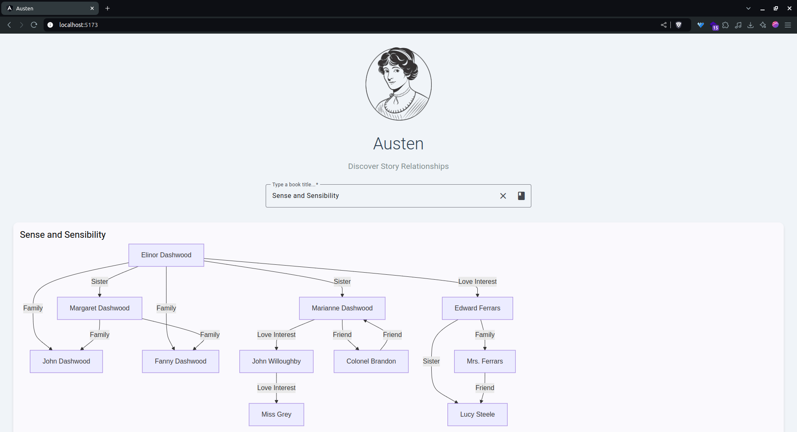

# Austen

Austen is an AI-powered Angular application initialized with Analog to generate relationships between book characters using Mermaid.

## Libraries Used

- [Angular](https://angular.dev)
- [Analog](https://analogjs.org/)
- [Mermaid](https://mermaid.live/)
- [Angular Material](https://material.angular.io/)

## API

- [Open Library](https://openlibrary.org)
- [Google Generative AI](https://ai.google/discover/generativeai)

## Screenshot

## Jane Austen logo reference

"Jane Austen Inspired Illustrations", CC-BY 4.0. Quelle: 
 https://colorconfetti.com/culture-history-environment/jane-austen/jane-austen-inspired-illustrations/