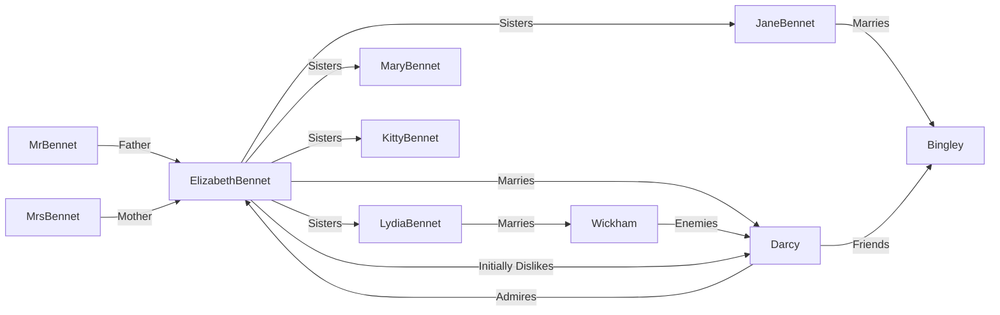

# Austen

Generate character relationship diagrams for books using Mermaid.js.

## Features

- 🔍 **Book search** — Find books via the OpenLibrary API
- 🤖 **AI-powered diagrams** — Generates Mermaid character relationship graphs
- 🔗 **Share links** — Copy a shareable encoded URL
- 📋 **Copy source** — Copy the Mermaid source
- 📚 **History** — Recently generated diagrams saved in your browser

## Example

[Pride and Prejudice — Jane Austen (1813)](https://herol3oy.github.io/austen/?graph=N4IgRg9hDWIFygC4EtEBsCm8QAUBOyAJhgAQCGAdoSfhgFYCuhyAxlgDQhkOIAWEeAM7wA2iABSlUgEEGgxBgogAupwAODMGmSDeATQxk88AIwAOEwGZOLCADcMeAJKFTAFktuzAVksB2AF9OAFtHYLIibABzPDI1XhIAFQARAB0KEkySAFFtAC8yMAw%2BACFFCmKSAFoqgD4AHwBZIwIMQXqSZKMWAE90rJJJCrKKCsRquqaW5DaOkuQKKMw%2BjKzc5AKi0vLKmoaAZR0FIQ6hjBGx-rX8wuLeC93Jw-lHdpIAGR7mMgfEK8z1ps7r8Jgcjq8Os08D1fv8cjctvcduM9vVnsc3gBpVCIGHIuFdPC9UH1ABirSob3mi2WcM%2B3xBqKhrTeAHVWNBeGRgnD2SxOdySdkKsEZm9Cb04YDbttRo8Gk4KKhkGQ0Ggep0dNpoLNOt0VgMJRrUdJCKK8LrpYjYatMo08IzJqSyHxHB0rcD8baSPbBI6Go0IK68O6EZ65YgQJwoopHC6MIRpJG4CAAEwABlTADYqum-FVUyZEiY3HB0944G4swA6ACcHgAWiAAkA)

```mermaid
graph LR
    ElizabethBennet -->|Marries| Darcy
    JaneBennet -->|Marries| Bingley
    ElizabethBennet -->|Sisters| JaneBennet
    ElizabethBennet -->|Sisters| LydiaBennet
    ElizabethBennet -->|Sisters| MaryBennet
    ElizabethBennet -->|Sisters| KittyBennet
    Darcy -->|Friends| Bingley
    LydiaBennet -->|Marries| Wickham
    Wickham -->|Enemies| Darcy
    ElizabethBennet -->|Initially Dislikes| Darcy
    Darcy -->|Admires| ElizabethBennet
    MrBennet -->|Father| ElizabethBennet
    MrsBennet -->|Mother| ElizabethBennet
```

## Credits

Jane Austen Inspired Illustrations, CC-BY 4.0. Quelle: https://colorconfetti.com/culture-history-environment/jane-austen/jane-austen-inspired-illustrations/
