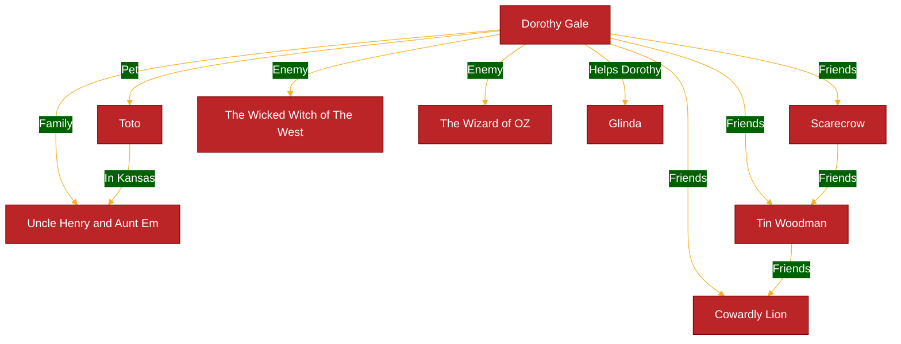

# Austen

Austen is an AI-powered Nextjs application to generate story relationships between book characters using Mermaidjs diagrams.

## Features

- 📚 Search and analyze any book from Open Library
- 🤖 AI-powered character relationship analysis
- 📊 Generate Mermaid diagrams
- 💾 Save, download (SVG, PNG) and manage your generated graphs
- 🌐 Share graphs publicly or keep them private
- 🔍 Discover public graphs generated by other users

## Example Graph

A character relationship graph generated for "The Wizard of Oz" by "L. Frank Baum":


```mermaid
%%{
  init: {
    'theme': 'base',
    'themeVariables': {
      'primaryColor': '#BB2528',
      'primaryTextColor': '#fff',
      'primaryBorderColor': '#7C0000',
      'lineColor': '#F8B229',
      'secondaryColor': '#006100',
      'tertiaryColor': '#fff'
    }
  }
}%%

  graph TD
    A[Dorothy Gale] -->|Pet| B[Toto]
    A -->|Family| C[Uncle Henry and Aunt Em]
    A -->|Friends| D[Scarecrow]
    A -->|Friends| E[Tin Woodman]
    A -->|Friends| F[Cowardly Lion]
    A -->|Enemy| G[The Wicked Witch of The West]
    A -->|Enemy| H[The Wizard of OZ]
    A -->|Helps Dorothy| I[Glinda]
    D -->|Friends| E
    E -->|Friends| F
    B -->|In Kansas| C
```

## Stacks:

- [Nextjs](https://nextjs.org)
- [React](https://react.dev)
- [TypeScript](https://www.typescriptlang.org)
- [Supabase](https://supabase.com)

## UI

- [Tailwindcss](https://tailwindcss.com/)
- [Shadcn/ui](https://ui.shadcn.com/)
- [Mermaid](https://mermaid.js.org)

## API

- [Open Library](https://openlibrary.org)
- [DeepSeek](https://deepseek.com)
- [OpenAI](https://platform.openai.com/docs/quickstart)
- [Brave Search API](https://brave.com/search/api/)

## Installation & Setup

1. Clone the repository:

   ```bash
   git clone https://github.com/herol3oy/austen.git
   cd austen
   ```

2. Install dependencies:

   ```bash
   npm i
   ```

3. Set up environment variables:

   - Copy `.env.local.example` to `.env.local`
   - Fill in the required API keys:
     ```env
     DEEPSEEK_API_KEY=your_deepseek_api_key
     VITE_PUBLIC_SUPABASE_URL=your_supabase_url
     VITE_PUBLIC_SUPABASE_ANON_KEY=your_supabase_anon_key
     ```

4. Set up Supabase:

   - Create a new Supabase project
   - Enable authentication
   - Create graphs table in the public schema:
     - id uuid primary key
     - book_name text not null
     - author_name text not null
     - svg_graph text not null
     - mermaid_syntax text not null
     - emojis text
     - user_id uuid
     - is_public boolean default false
     - created_at timestamp

5. Start the development server:

   ```bash
   npm run dev
   ```

6. Build for production:
   ```bash
   npm run build
   ```

## TODO

- [ ] Implement Like/Unlike Functionality for Graphs

  - [ ] Add like button
  - [ ] Implement like/unlike API endpoints in Supabase
  - [ ] Add like count display

- [ ] Load more graphs in the discover page
  - [ ] Add a button to load more graphs

## Screenshot

## Jane Austen logo reference

"Jane Austen Inspired Illustrations", CC-BY 4.0. Quelle:
https://colorconfetti.com/culture-history-environment/jane-austen/jane-austen-inspired-illustrations/

## License

[MIT LICENSE](LICENSE)
